# NapCat WebUI

## 功能

- WebUI登录
- QQ登录
- 网络配置
- OneBot/WebUI配置
- 日志查看（实时日志、历史日志）
- HTTP调试
- WS调试
- 在线音乐播放器，支持网易云音乐歌单（大屏在页面右下角，小屏在页面下方）

如果你有更多功能需求，欢迎在 issue 中提出。

## Screenshots

| 场景 | 亮色 | 暗色 |
|------|------|------|
| WebUI登录 | 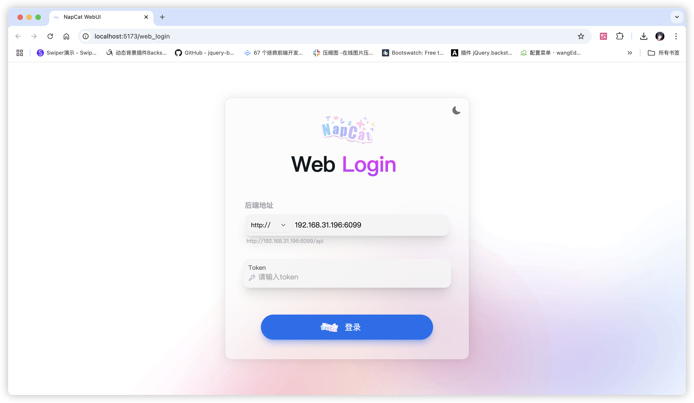 | 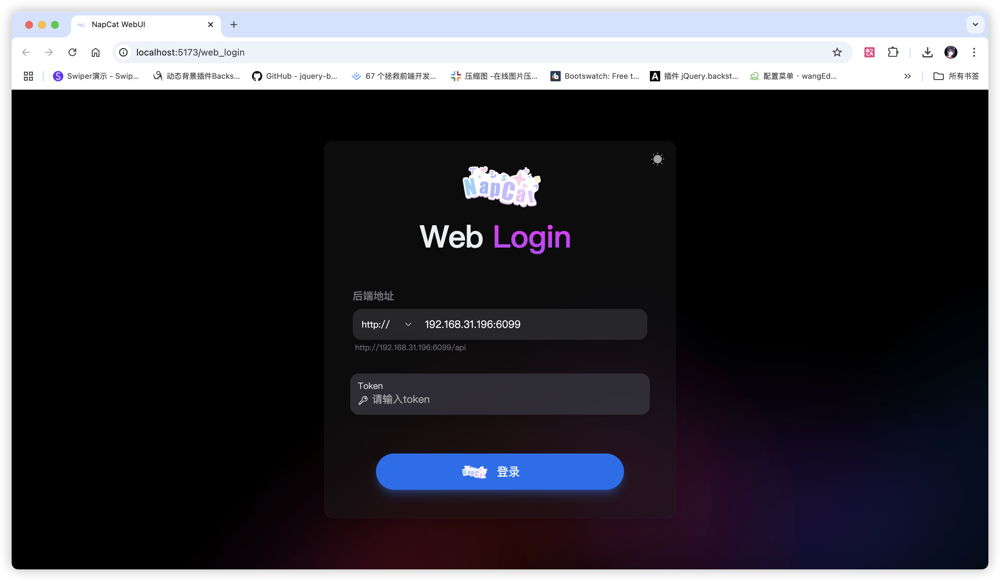 |
| QQ登录 | 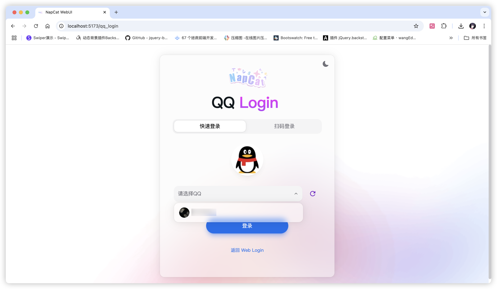 | 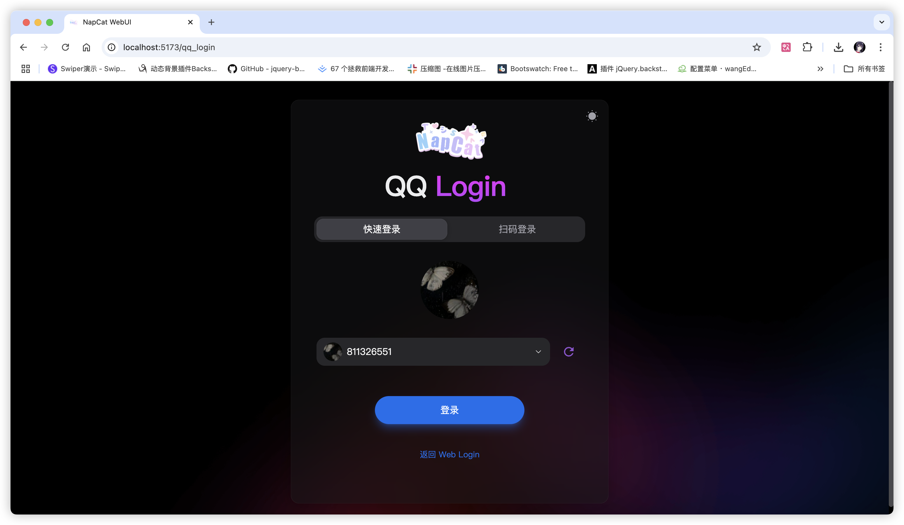 |
| 网络列表 | 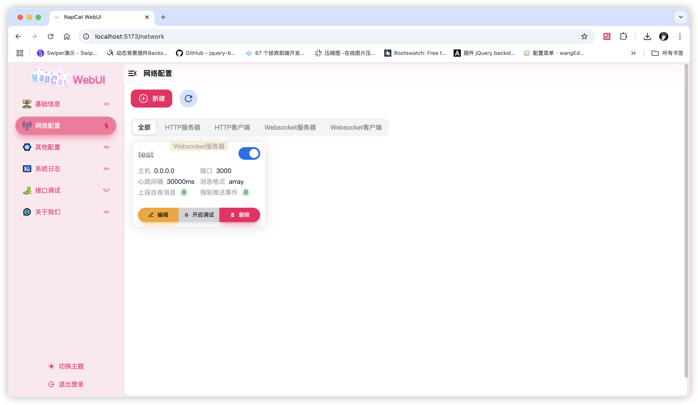 | 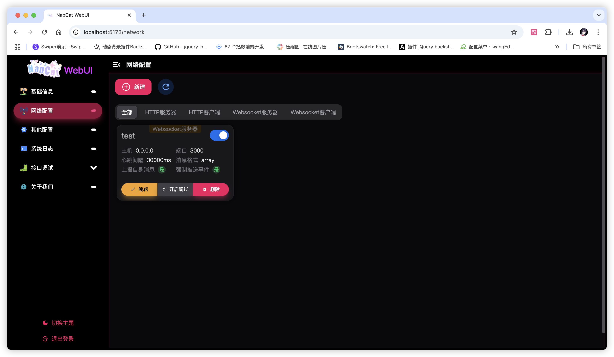 |
| 网络编辑 | 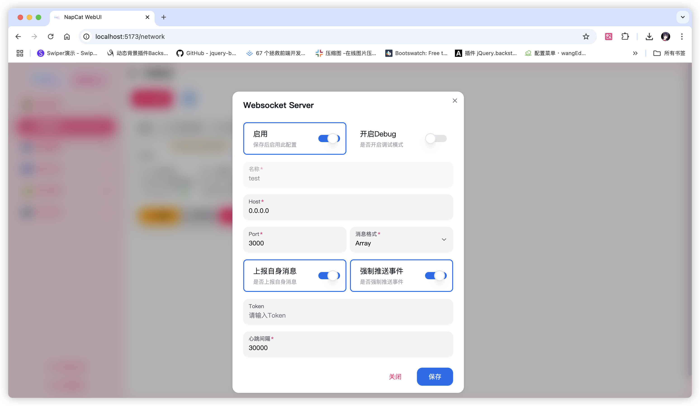 | 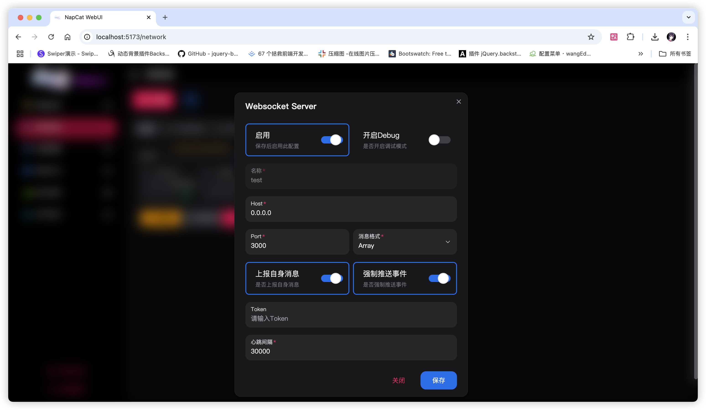 |
| 日志 | 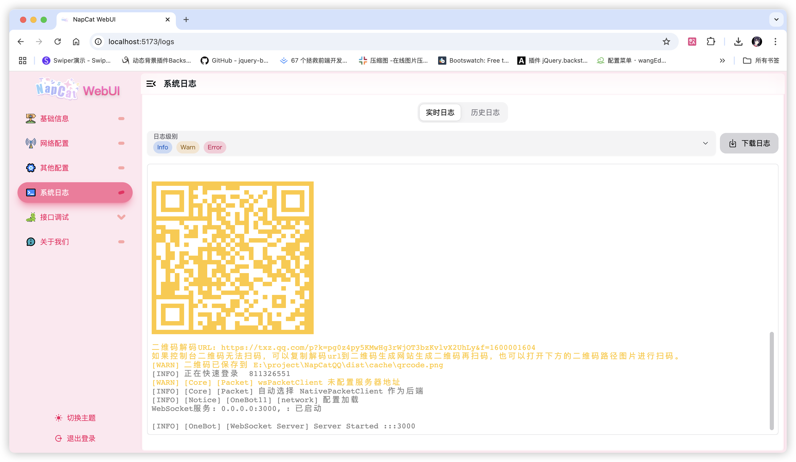 | 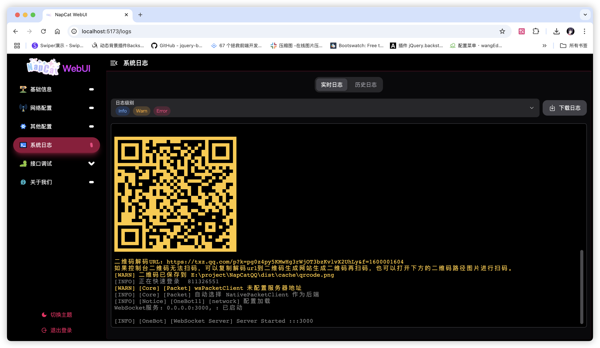 |
| HTTP调试 | 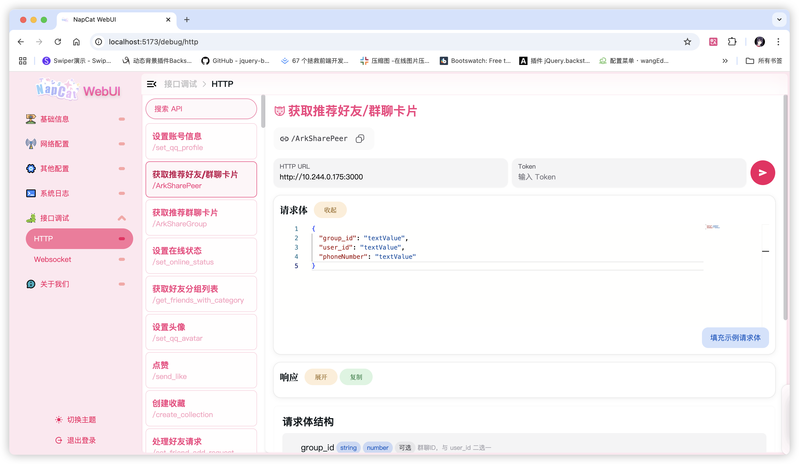 | 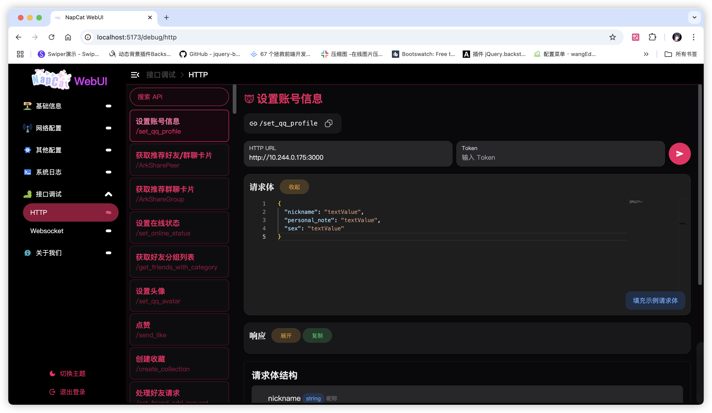 |
| WS调试 |  | 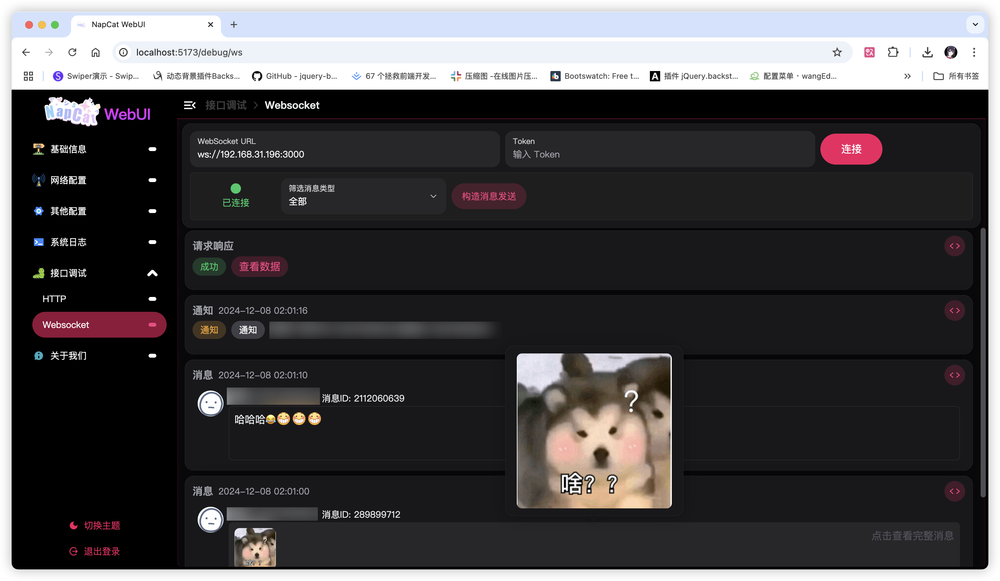 |

## Directly deploy via [Vercel](https://vercel.com/)

Recommended if you only use localhost NapCat.

1. Fork this repository
2. Create a new project on Vercel
3. Import the forked repository
4. Configure the project settings
   1. Edit the build command to `npm run webui:build`
   2. Edit your custom domain
5. Deploy the project


# Build

## Via NPM

```bash
$ npm install
$ npm run webui:build
```

## Via Yarn

```bash
$ yarn install
$ yarn webui:build
```

## Via PNPM

```bash
$ pnpm install
$ pnpm webui:build
```

# Deploy

## Via Nginx 

Recommended if you deploy on your own server. Often used to resolve `Network Error` (HTTPS can't request HTTP) in your browser.

```nginx
server {
    listen 80;
    server_name localhost;

    location / {
        root /path/to/napcat-webui/dist;
        index index.html;
        try_files $uri $uri/ /index.html;
    }
}
```

## Via Apache

```apache
<VirtualHost *:80>
    ServerName localhost

    DocumentRoot /path/to/napcat-webui/dist
    DirectoryIndex index.html

    <Directory /path/to/napcat-webui/dist>
        Options Indexes FollowSymLinks
        AllowOverride All
        Require all granted
    </Directory>
</VirtualHost>
```

# Development

via NPM

```bash
$ npm install
$ npm run webui:dev
```

via Yarn

```bash
$ yarn install
$ yarn webui:dev
```

via PNPM

```bash
$ pnpm install
$ pnpm webui:dev
```

# License

[MIT](LICENSE)

# Related Projects

- [NapCat](https://github.com/NapNeko/NapCatQQ/)
- [Karin](https://github.com/KarinJS/Karin/)

# Thanks to

- [Vercel](https://vercel.com/)
- [React](https://react.dev/)
- [NextUI](https://nextui.org/)
- and more open-source projects

感谢群友“维拉”提供的在线音乐API。